# 1. 产品介绍

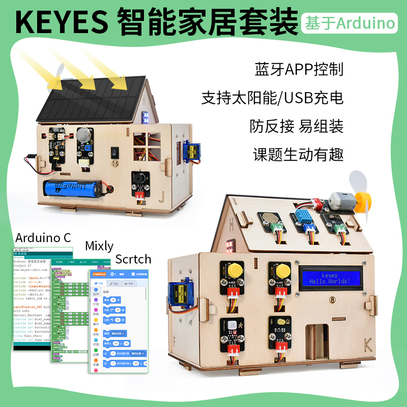

## 1.1 产品介绍

智能家居是未来的发展趋势。通过远程智能化技术来控制设备的方式已越来越贴近于人们的生活。智能家居也越来越受大家的喜爱和重视，而智能家居系统就是以提高家庭居住环境为目的的，它融合了计算机，网络通信，自动控制等现代科学技术，Arduino
智能家居除了能远程操控之外，还可以实现自动控制功能：窗帘自动切换，下雨自动关窗，天黑自动打开灯等；供电系统使用太阳能方式给锂电池进行充电；进而形成的集功能性的、智能性、服务性为一体的舒适实用、安全便利、绿色环保的智能系统。

Arduino智能家居套件我们提供有Arduino C/Mixly和Scratch图形编程的教程，满足不同年龄段的人。跟随我们享受DIY的乐趣！

## 1.2 产品特点

本产品集成了舵机开关门窗、温湿度检测功能、人体红外功能、LCD显示功能和蓝牙控制等功能。智能家居的无源蜂鸣器，可以发声警报；光敏传感器和水滴传感器可以检测光照强度和下雨情况；WS2812 RGB模块，可以显示不同颜色；小风扇的速度可以通过PWM信号调节；

本产品通过太阳能充电板给开发板供电，安装接线和拆装电池时，注意线和电池的正负极，务必不要把电池的正负极接反（**产品使用18650电池，需自备**）。

## 1.3 产品参数

- 连接器端口输入：DC 6V---9V

- 太阳能充电板输出电压：6.5V

- 最大输出电流：800mA

- 最大功率：5.2W

- 工作温度范围：0-50℃

- 环保属性：ROHS

## 1.4 产品清单

| 序号 | 名称                           | 备用量 | 图片                                                         |
| ---- | ------------------------------ | ------ | ------------------------------------------------------------ |
| 1    | Keyes Plus 开发板              | 1      |                      |
| 2    | TYPE C数据线                   | 1      |                      |
| 3    | keyes 传感器扩展板             | 1      |                      |
| 4    | BT-24 蓝牙模块                 | 1      | 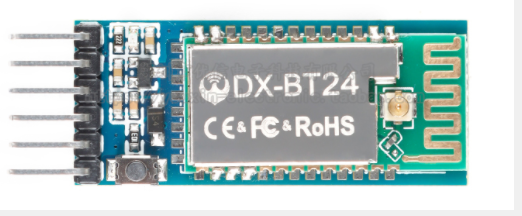                     |
| 5    | Keyes单路按键模块              | 2      | 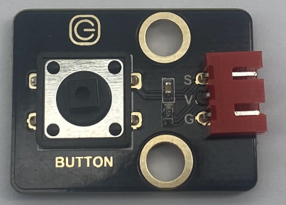                     |
| 6    | 按键帽                         | 2      | 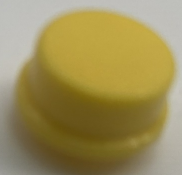                     |
| 7    | Keyes 人体红外热释传感器       | 1      | 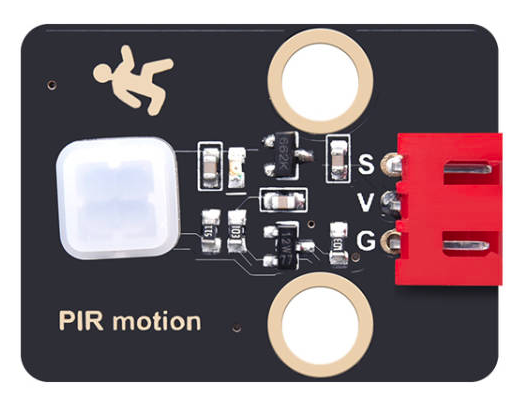                     |
| 8    | Keyes MQ-2模拟气体传感器       | 1      | 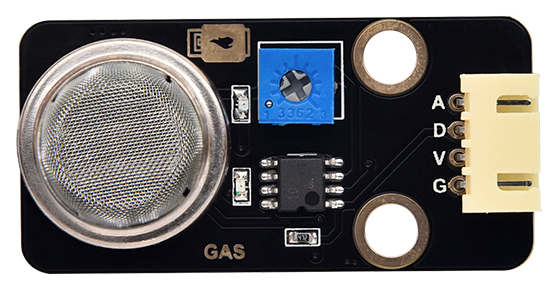                     |
| 9    | Keyes 光敏电阻传感器           | 1      | 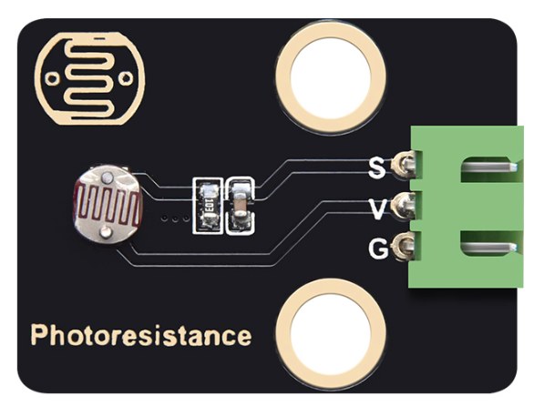                     |
| 10   | Keyes 无源蜂鸣器模块           | 1      | 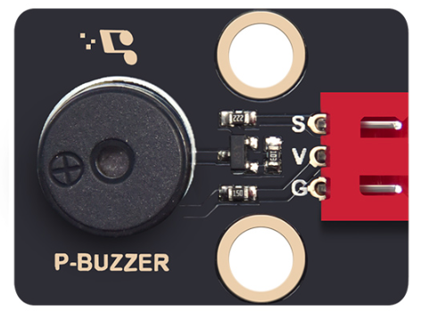                     |
| 11   | keyes 130电机模块              | 1      | 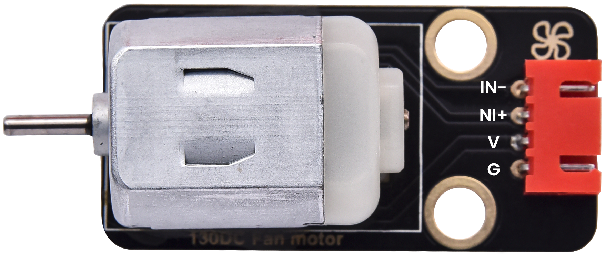                     |
| 12   | 扇叶                           | 1      | 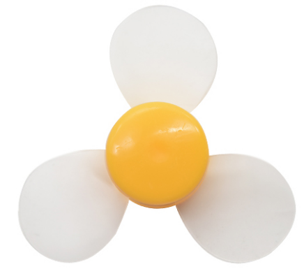                     |
| 13   | keyes水滴传感器                | 1      |                      |
| 14   | Keyes LCD1602屏                | 1      | 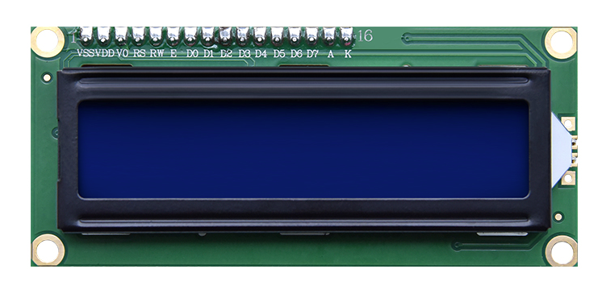                     |
| 15   | Keyes 温湿度传感器             | 1      | 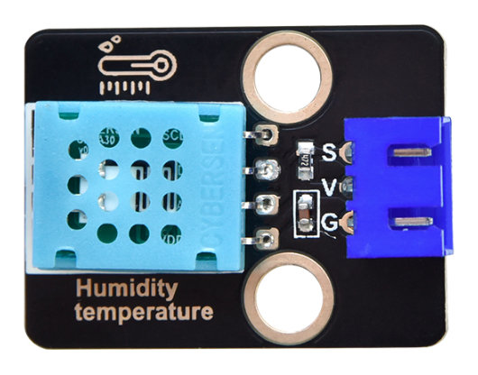                     |
| 16   | keyes LED模块                  | 1      |                      |
| 17   | Keyes 6812 RGB模块             | 1      | 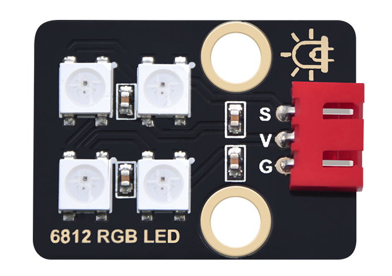                     |
| 18   | 太阳能与USB充电锂电池电源模块  | 1      | 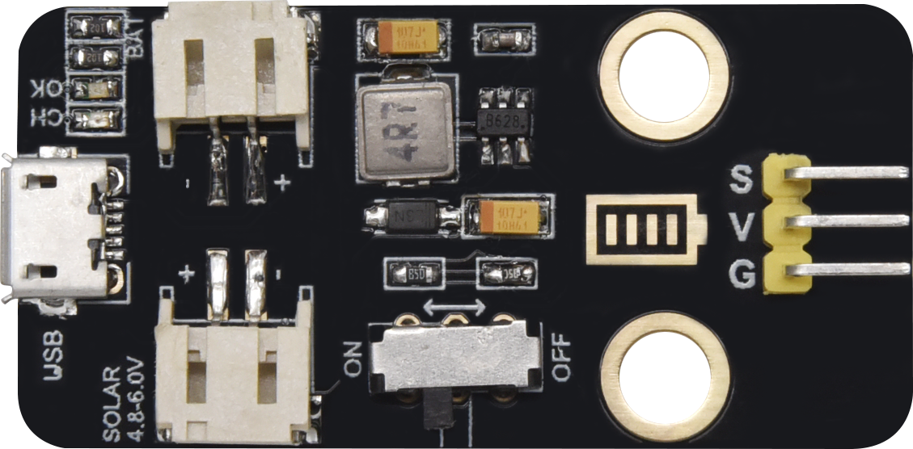                     |
| 19   | microbit智能家居电池盒         | 1      | 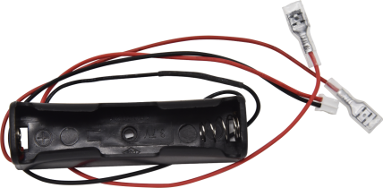                     |
| 20   | 太阳能电池板                   | 1      | 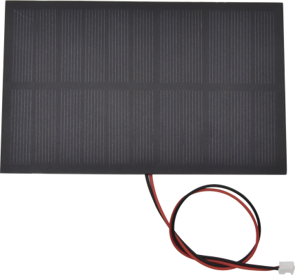                     |
| 21   | SG90 180度舵机                 | 1      | 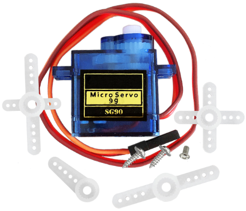                     |
| 22   | 十字螺丝刀                     | 1      | 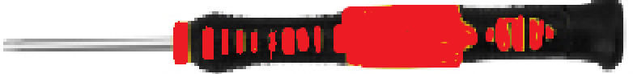 |
| 23   | 船型开关                       | 1      | 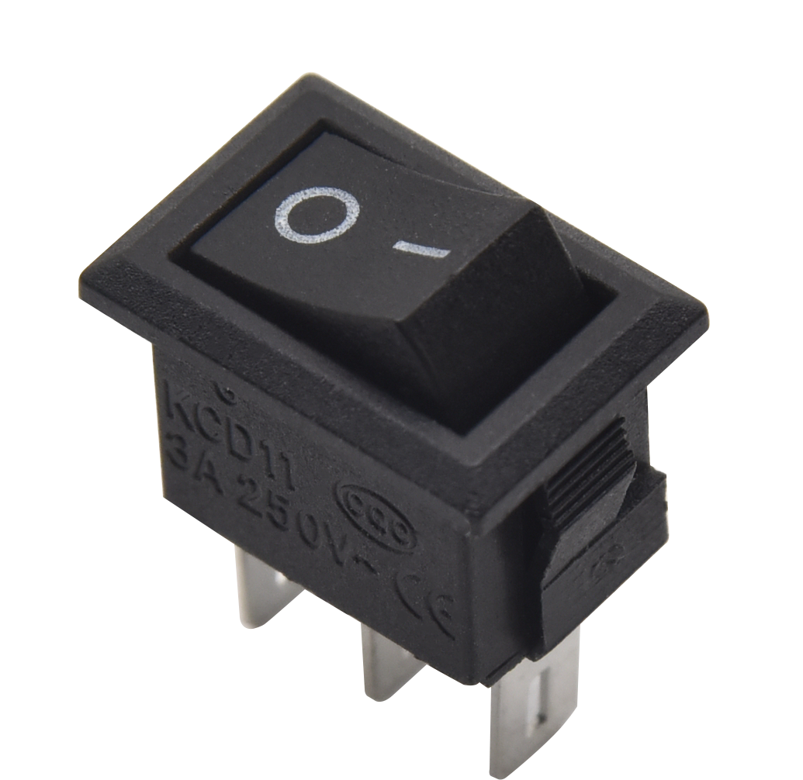                     |
| 24   | 3P转杜邦母单连接线             | 10     | 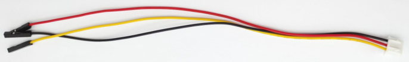                     |
| 25   | 4P转杜邦母单连接线             | 3      | 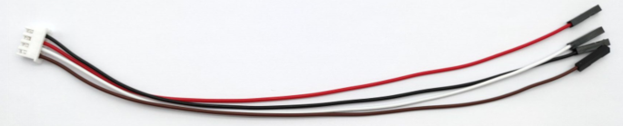                     |
| 26   | M3*8MM 平头螺钉                | 2      | 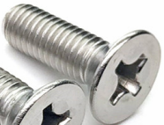                     |
| 27   | M2 镀镍螺母                    | 5      | 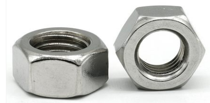                     |
| 28   | M3 镀镍螺母                    | 6      |                      |
| 29   | M4 镀镍螺母                    | 26     |                      |
| 30   | M2*12MM 圆头螺钉               | 5      | 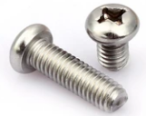                     |
| 31   | M3*10MM 圆头 十字螺钉          | 9      |                      |
| 32   | M4*8MM 圆头 十字螺钉           | 26     |                      |
| 33   | M3 镀镍 自锁螺母               | 5      | 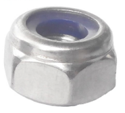                     |
| 34   | M1.4*6MM 圆头十字螺钉          | 8      |                      |
| 35   | M3*10MM 双通铜柱               | 5      | 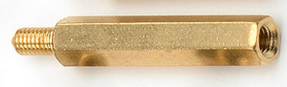                     |
| 36   | M3*6MM 圆头 十字螺钉           | 9      | 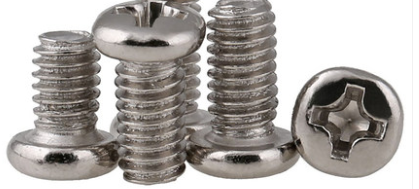                     |
| 37   | M1.2*4MM 圆头 十字 自攻 螺丝头 | 4      | 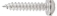                     |
| 38   | 椴木板                         | 1      | 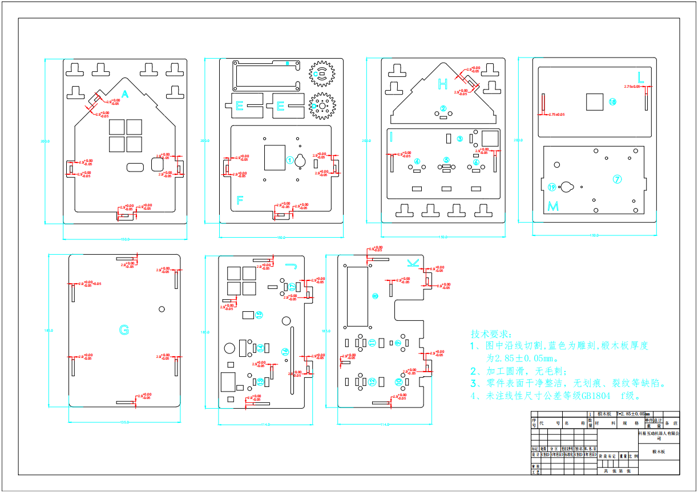                     |
| 39   | 智能家居亚克力板 两片          | 1      | 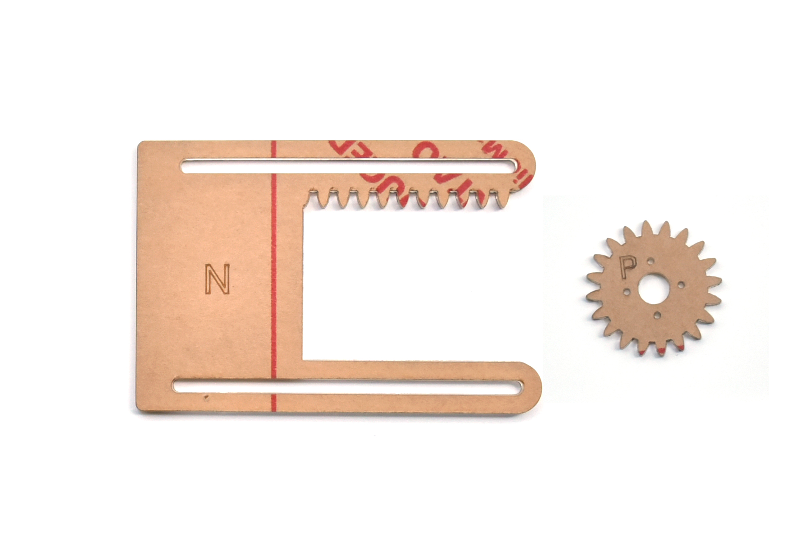                     |
| 40   | 十字扳手 M2、M3、M4螺母        | 1      | 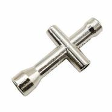                     |
| 41   | 2.0*40MM 十字螺丝刀            | 1      | 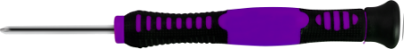                     |
| 42   | DC头连接线                     | 1      | 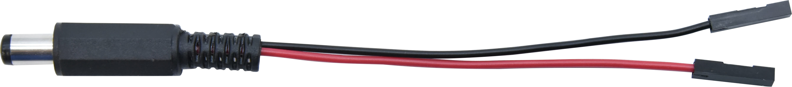                     |

## 1.5 主板介绍

（1）说明

在开始所有的项目之前，我们首先要了解下面这片arduino uno Plus开发板，因为这个智能家居的核心就是这个开发板。

UNO Plus开发板是我们最新推出的一款易用型开源控制器，硬件上与Arduino UNO相比并没有大的变动。外观上我们将蓝色换成了红色，给你们一种新的体验。硬件上，我们用ATMEGA328P-AU代替了8U2，使用type-c接口，外观美观正反面都可以接。

（2）规格参数

| 微控制器                | ATmega328P-PU                      |
| ----------------------- | ---------------------------------- |
| 工作电压                | 5V                                 |
| 外接电压端口输入电压    | DC7-12V                            |
| 数字引脚                | 14 (D0-D13) (其中包含6个PWM输出口) |
| PWM引脚                 | 6 个(D3, D5, D6, D9, D10, D11)     |
| 模拟输入引脚            | 6 个(A0-A5)                        |
| 每个I / O引脚的直流电流 | 20 mA                              |
| 3.3V引脚的直流电流      | 50 mA                              |
| 5V引脚的直流电流        | 最大2A                             |
| Flash Memory            | 32 KB（其中引导程序使用0.5 KB）    |
| SRAM                    | 2 KB (ATmega328P-PU)               |
| EEPROM                  | 1 KB (ATmega328P-PU)               |
| 时钟频率                | 16 MHz                             |
| LED按键                 | D13                                |

（3）各个接口和主要元件说明

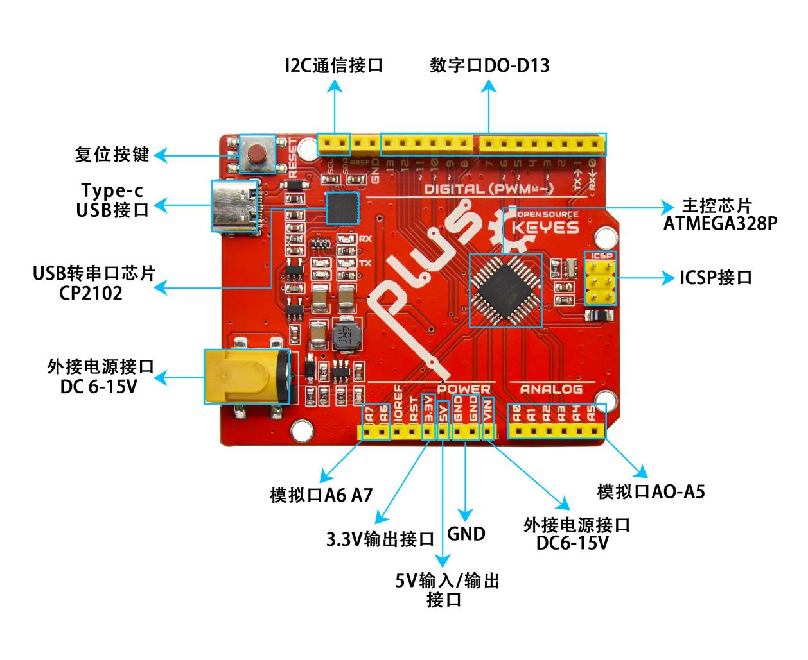

串口通信接口：D0为RX、D1为TX

PWM接口（脉宽调制）：D3 D5 D6 D9 D10 D11

外部中断接口：D2(中断0)和D3 (中断1)

SPI通信接口：D10为SS、D11为MOSI、D12为MISO、D13为SCK

IIC通信端口：A4为SDA、A5为SCL

## 1.6 扩展板介绍

keyes传感器扩展板是与uno Plus开发板配合使用的，它将uno Plus开发板全部数字口与模拟口以舵机线序形式扩展出来，还特设IIC接口、串口通信接口、SPI通信接口、NRF24L01无线模块通信接口等接口。不必为繁琐复杂电路连线而头疼了，这款传感器扩展板真正意义上的将电路简化，能够很容易地将常用传感器连接起来，仅需要一种通用3P或4P连接线就可以把连接上传感器。

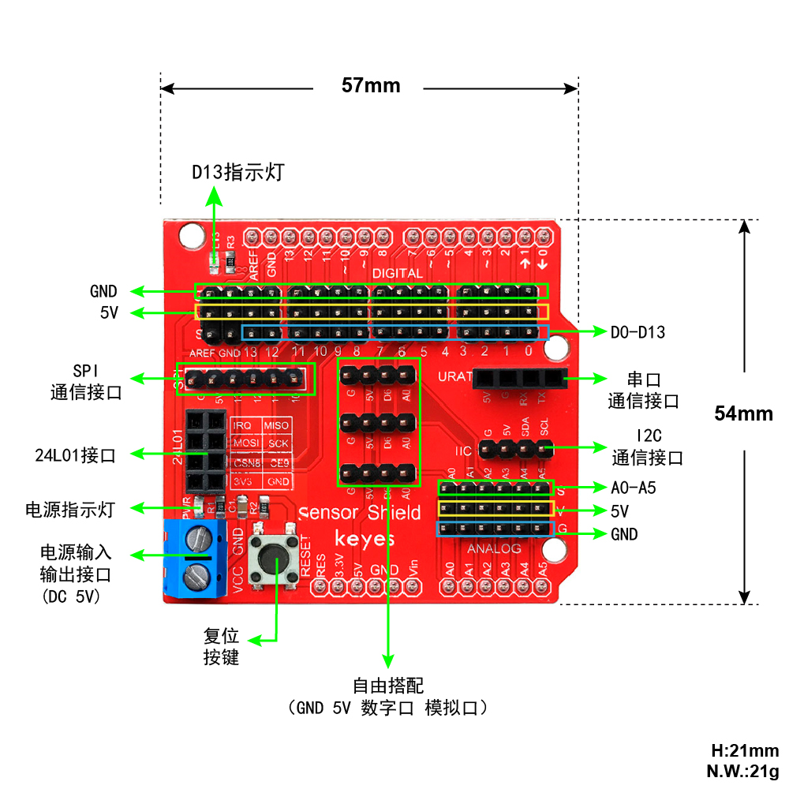

