首先感谢选择keyes产品,

我们将继续为你提供好的产品和服务!

关于keyes
=========

Keyes是KEYES
Corporation旗下最畅销的品牌，我们的产品包括Arduino开发板、扩展板、传感器模块；树莓派、micro：bit扩展板和智能小车；以及为各阶段客户设计的完整入门套件。这些入门套件旨在为任何水平的客户学习Arduino、树莓派、micro：bit相关知识。

我们所有产品，均符合国际质量标准，在世界各地不同市场中，得到了极大的赞赏。

欢迎从我们的官方网站查看更多内容：

`www.keyes-robot.com <http://www.keyestudio.com>`__

获取资料和售后服务

| 1.Arduino
| 智能家居套装资料下载链接：\ https://pan.baidu.com/s/1duOaGpQKyVsSWqGuk30e0A

提取码：keye

2.如果发现某些东西丢失或损坏，或者学习套件时遇到一些困难。keyes会提供免费和快速的支持，如果您有任何疑问，请联系我们专业的销售人员。

3.欢迎提出建议和反馈，我们会根据您的反馈不断更新套件和教程，以使其更好。谢谢！

产品安全

1.本产品内含细小的零件（螺丝，铜柱等），请放在儿童接触不到的地方，防止划伤或误食。8岁及以下儿童使用，请在大人监督下使用。

2.本产品包含导电部件(控制板和电子模块），请按照本教程的要求进行操作，不当的操作可能导致过热并且损害零件，请勿触摸并立即断开电路电源。

版权

keyes商标和徽标是KEYES DIY ROBOT
co.,LTD的版权,任何人和公司在没有授权的情况下，不得复制，售卖，转卖，keyes品牌的产品。如果您有兴趣在当地售卖我们的产品，请联系我们专业的批发销售人员。

Keyes Arduino brick 智能家居套装

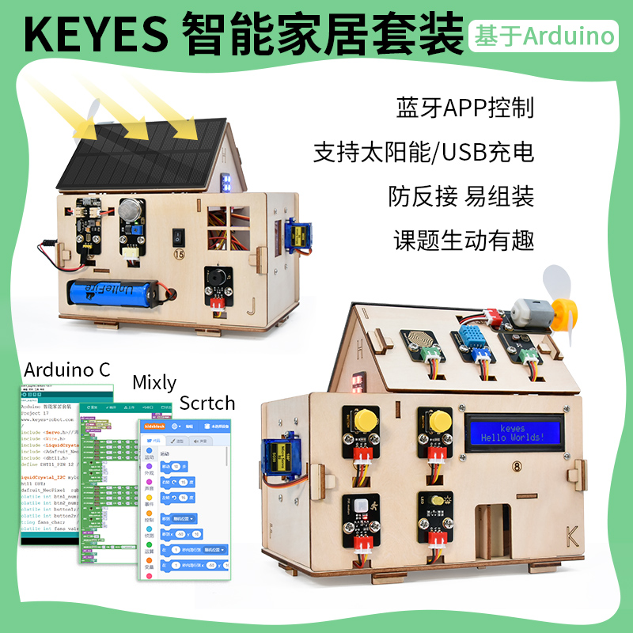

产品介绍
--------

| 智能家居是未来的发展趋势。通过远程智能化技术来控制设备的方式已越来越贴近于人们的生活。智能家居也越来越受大家的喜爱和重视，而智能家居系统就是以提高家庭居住环境为目的的，它融合了计算机，网络通信，自动控制等现代科学技术，Arduino
| 智能家居除了能远程操控之外，还可以实现自动控制功能：窗帘自动切换，下雨自动关窗，天黑自动打开灯等；供电系统使用太阳能方式给锂电池进行充电；进而形成的集功能性的、智能性、服务性为一体的舒适实用、安全便利、绿色环保的智能系统。

Arduino智能家居套件我们提供有Arduino
C/Mixly和Scratch图形编程的教程，满足不同年龄段的人。跟随我们享受DIY的乐趣！

产品特点
--------

本产品集成了舵机开关门窗、温湿度检测功能、人体红外功能、LCD显示功能和蓝牙控制等功能。智能家居的无源蜂鸣器，可以发声警报；光敏传感器和水滴传感器可以检测光照强度和下雨情况；WS2812
RGB模块，可以显示不同颜色；小风扇的速度可以通过PWM信号调节；

本产品通过太阳能充电板给开发板供电，安装接线和拆装电池时，注意线和电池的正负极，务必不要把电池的正负极接反（\ **产品使用18650电池，需自备**\ ）。

产品参数
--------

连接器端口输入：DC 6V---9V

太阳能充电板输出电压：6.5V

最大输出电流：800mA

最大功率：5.2W

工作温度范围：0-50℃

尺寸：

环保属性：ROHS

产品清单
--------

.. container:: table-wrapper

   ==== ========= ============================== ======
   序号 图片      规格                           倍用量
   ==== ========= ============================== ======
   1    |image1|  Keyes Plus 开发板              1
   2    |image2|  TYPE C数据线                   1
   3    |image3|  keyes 传感器扩展板             1
   4    |image4|  BT-24 蓝牙模块                 1
   5    |image5|  Keyes单路按键模块              2
   6    |image6|  按键帽                         2
   7    |image7|  Keyes 人体红外热释传感器       1
   8    |image8|  Keyes MQ-2模拟气体传感器       1
   9    |image9|  Keyes 光敏电阻传感器           1
   10   |image10| Keyes 无源蜂鸣器模块           1
   11   |image11| keyes 130电机模块              1
   12   |image12| 扇叶                           1
   13   |image13| keyes水滴传感器                1
   14   |image14| Keyes LCD1602屏                1
   15   |image15| Keyes 温湿度传感器             1
   16   |image16| keyes LED模块                  1
   17   |image17| Keyes 6812 RGB模块             1
   18   |image18| 太阳能与USB充电锂电池电源模块  1
   19   |image19| microbit智能家居电池盒         1
   20   |image20| 太阳能电池板                   1
   21   |image21| SG90 180度舵机                 2
   22   |image22| 十字螺丝刀                     1
   23   |image23| 船型开关                       1
   24   |image24| 3P转杜邦母单连接线             10
   25   |image25| 4P转杜邦母单连接线             3
   26   |image26| M3*8MM 平头螺钉                2
   27   |image27| M2 镀镍螺母                    5
   28   |image28| M3 镀镍螺母                    6
   29   |image29| M4 镀镍螺母                    26
   30   |image30| M2*12MM 圆头螺钉               5
   31   |image31| M3*10MM 圆头 十字螺钉          9
   32   |image32| M4*8MM 圆头 十字螺钉           26
   33   |image33| M3 镀镍 自锁螺母               5
   34   |image34| M1.4*6MM 圆头十字螺钉          8
   35   |image35| M3*10MM 双通铜柱               5
   36   |image36| M3*6MM 圆头 十字螺钉           9
   37   |img|     M1.2*4MM 圆头 十字 自攻 螺丝头 4
   38   |image37| 椴木板                         1
   39   |image38| 智能家居亚克力板 两片          1
   40   |image39| 十字扳手 M2、M3、M4螺母        1
   41   |image40| 2.0*40MM 十字螺丝刀            1
   42   |image41| DC头连接线                     1
   ==== ========= ============================== ======

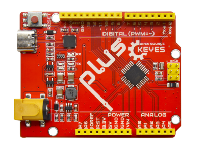
.. |image2| image:: media/5ff79cbf407333d10c51ddeb32401630.png
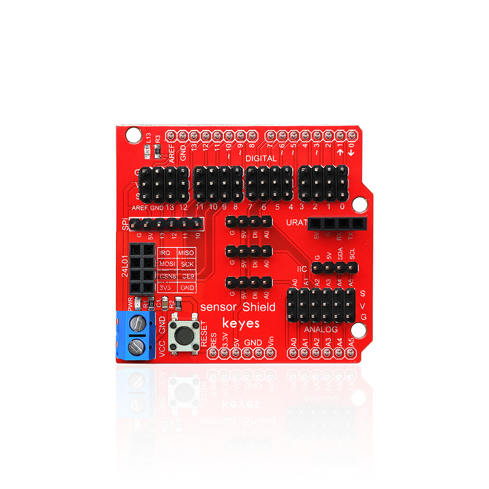
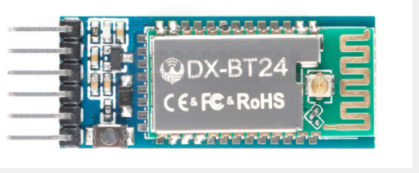
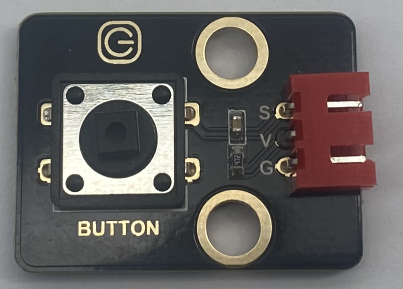
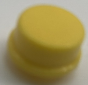
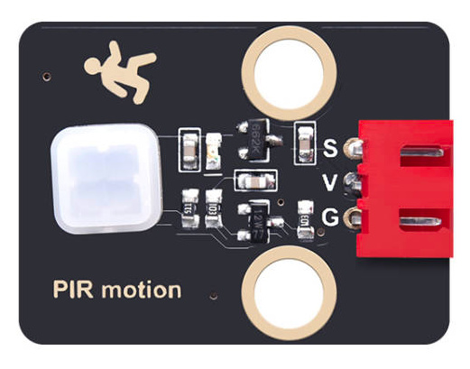
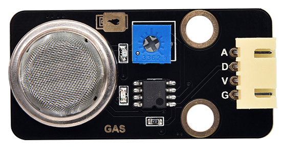
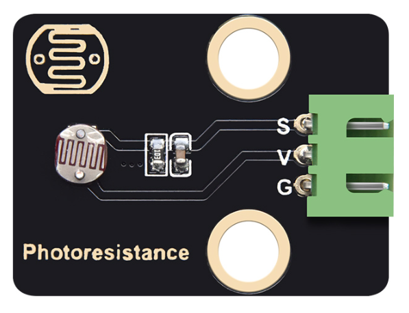
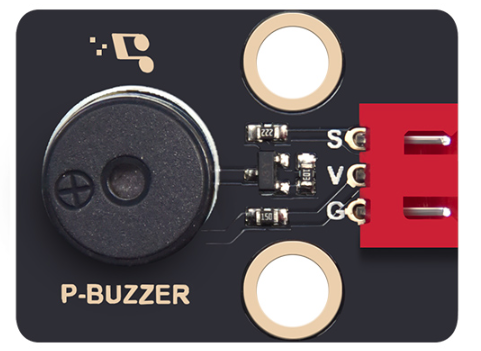
.. |image11| image:: media/6d454cc922ceff4087d9ab1e5ccf030f.png
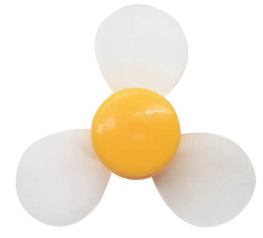
.. |image13| image:: media/389486699548b77a36f4d16b660b3595.png
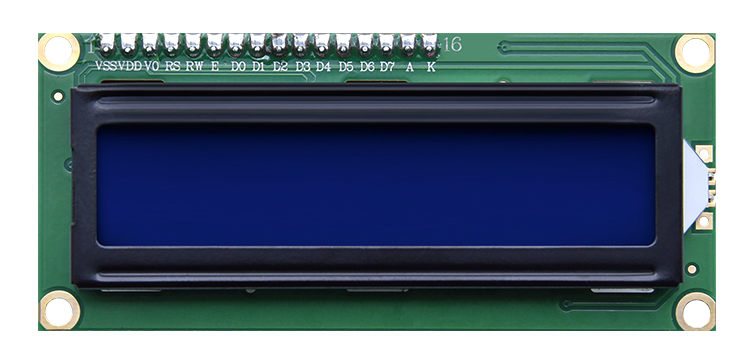
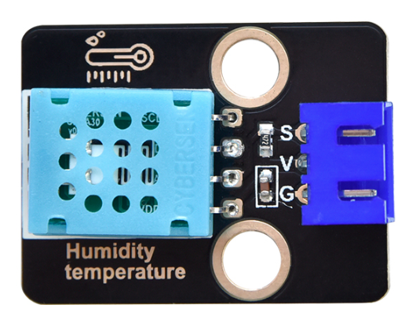
.. |image16| image:: media/1b75ff37c28a8008ad7c2dbe3408a9df.png
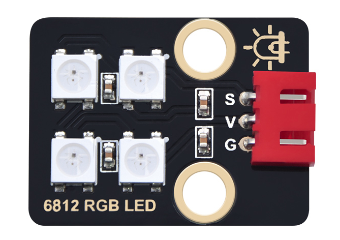
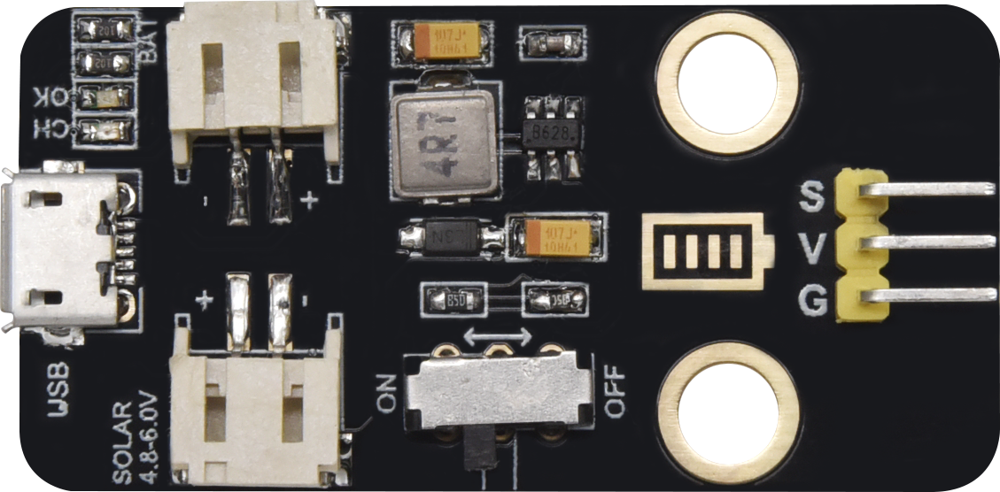
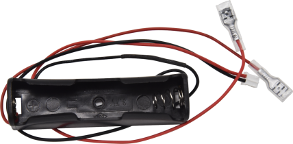
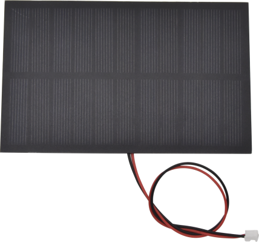
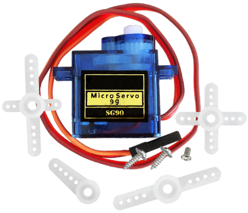
.. |image22| image:: media/f353b46e6c2c0597c3268d5aa137fd99.png
.. |image23| image:: media/3a51369d847ce4e8cb003900b8ae43f4.png
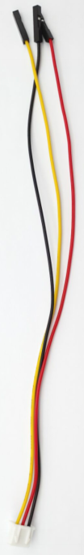
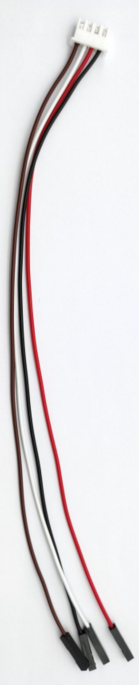
.. |image26| image:: media/2991c80d0f141474a234a1b915866506.png
.. |image27| image:: media/40828578b370119a7a5c40dcc412f9c6.png
.. |image28| image:: media/40828578b370119a7a5c40dcc412f9c6.png
.. |image29| image:: media/40828578b370119a7a5c40dcc412f9c6.png
.. |image30| image:: media/90f262e52991756983f29416b65889de.png
.. |image31| image:: media/90f262e52991756983f29416b65889de.png
.. |image32| image:: media/90f262e52991756983f29416b65889de.png
.. |image33| image:: media/2921490c73e7ec456e68d03f26cd638d.png
.. |image34| image:: media/b05fb368afcc7f64143fd15972aa1fcc.png
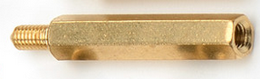
.. |image36| image:: media/de8991dc2b94e7a9a01e24239cf77500.png
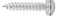
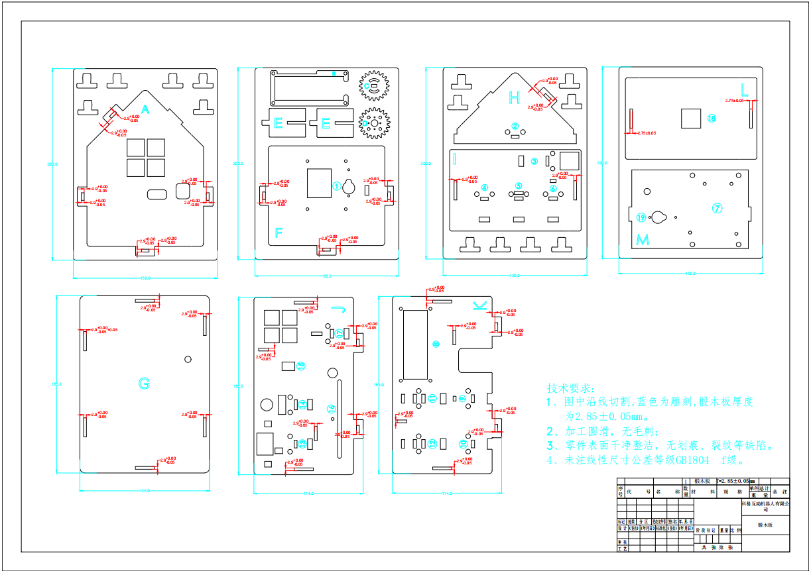
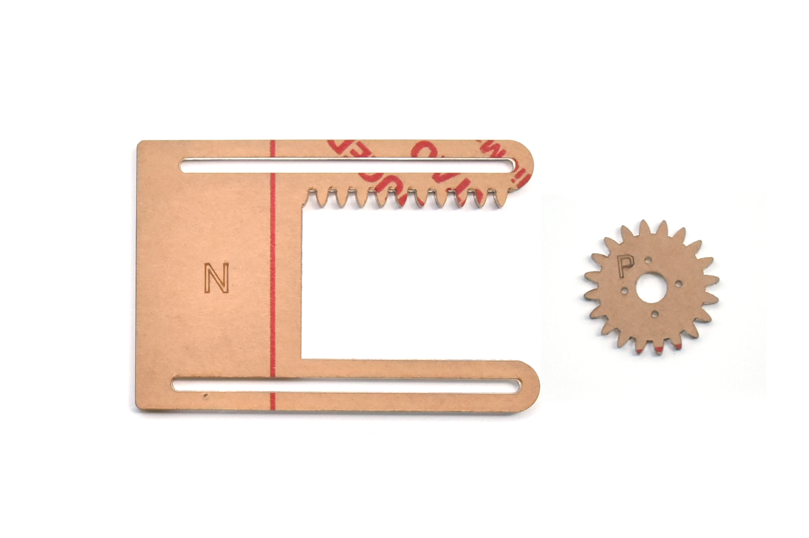
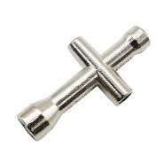
.. |image40| image:: media/aa12dd0fe16e3f122e1822f671b3c0c7.png
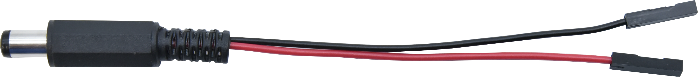
