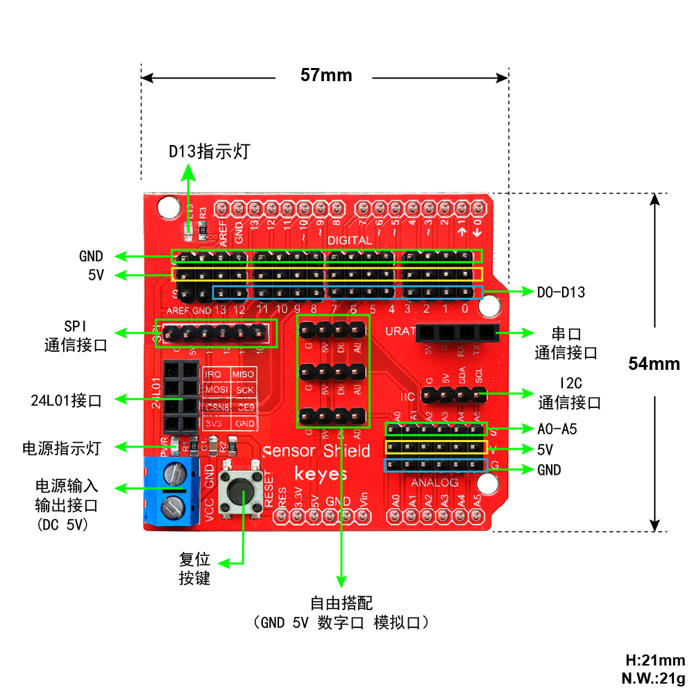

# 主板及扩展板介绍

## 第一小节 控制板简介

（1）说明

在开始所有的项目之前，我们首先要了解下面这片arduino uno Plus开发板，因为这个智能家居的核心就是这个开发板。

UNO Plus开发板是我们最新推出的一款易用型开源控制器，硬件上与Arduino UNO相比并没有大的变动。外观上我们将蓝色换成了红色，给你们一种新的体验。硬件上，我们用ATMEGA328P-AU代替了8U2，使用type-c接口，外观美观正反面都可以接。

（2）规格参数

|微控制器|ATmega328P-PU|
|-|-|
|工作电压|5V|
|外接电压端口输入电压|DC7-12V|
|数字引脚|14 (D0-D13) (其中包含6个PWM输出口)|
|PWM引脚|6 个(D3, D5, D6, D9, D10, D11)|
|模拟输入引脚|6 个(A0-A5)|
|每个I / O引脚的直流电流|20 mA|
|3.3V引脚的直流电流|50 mA|
|5V引脚的直流电流|最大2A|
|Flash Memory|32 KB（其中引导程序使用0.5 KB）|
|SRAM|2 KB (ATmega328P-PU)|
|EEPROM|1 KB (ATmega328P-PU)|
|时钟频率|16 MHz|
|LED按键|D13|

（3）各个接口和主要元件说明

  
串口通信接口：D0为RX、D1为TX

PWM接口（脉宽调制）：D3 D5 D6 D9 D10 D11

外部中断接口：D2(中断0)和D3 (中断1)

SPI通信接口：D10为SS、D11为MOSI、D12为MISO、D13为SCK

IIC通信端口：A4为SDA、A5为SCL

## 第二小节 扩展板的简介 

keyes传感器扩展板是与uno Plus开发板配合使用的，它将uno Plus开发板全部数字口与模拟口以舵机线序形式扩展出来，还特设IIC接口、串口通信接口、SPI通信接口、NRF24L01无线模块通信接口等接口。不必为繁琐复杂电路连线而头疼了，这款传感器扩展板真正意义上的将电路简化，能够很容易地将常用传感器连接起来，仅需要一种通用3P或4P连接线就可以把连接上传感器。

