## 开发环境配置

### 第一小节 在Windows系统电脑详细使用方法

（1）安装Arduino IDE

你可以进入以下网址下载Arduino IDE：<https://www.arduino.cc/>，点击后，显示如下图。

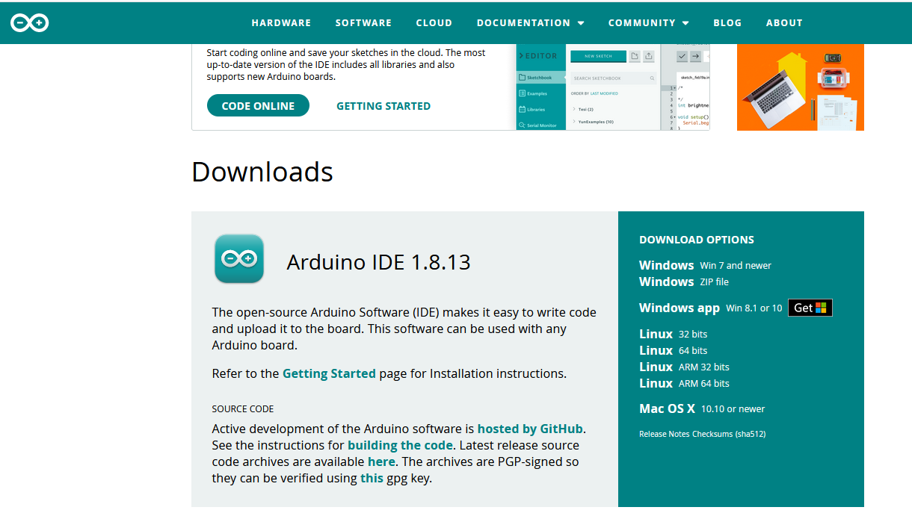

点击下图，

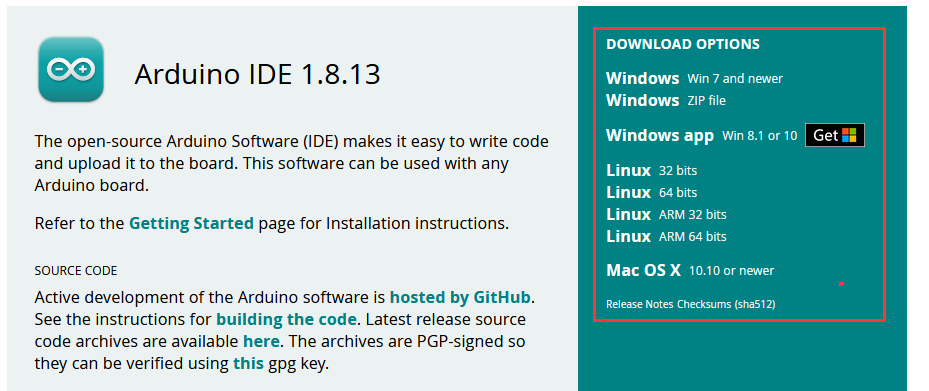

就可以下载最新的1.8.13版本IDE，同时我们可以点击下图，选择你需要的版本IDE。

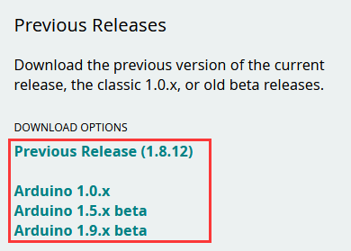

我们选择安装1.8.13版本Arduino IDE，当我们点击，代表下载安装文件(.exe)
，需要手动安装。当我们点击，代表直接下载1.8.12版本Arduino IDE，是一个压缩文件，解压就可以使用，无需安装。

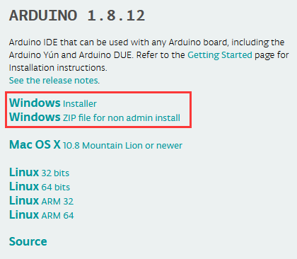

（2）安装驱动文件

软件下载完毕，我们开始为Uno Plus 开发板安装驱动。Uno Plus
开发板的USB转串口芯片用的是著名的CP2102 芯片，在ARDUINO
开发软件1.8以上的版本里就已经包含了这个芯片的驱动程序，这样我们使用起来会非常方便。一般插上USB，电脑就会识别到硬件，WINDOWS就会自动安装CP2102的驱动。

如果驱动安装不成功，或者你想手动安装驱动，请打开电脑的设备管理器

显示CP2102的驱动没有安装成功，有一个黄色的感叹号。我们双击硬件更新驱动

浏览计算机查找驱动程序，先找到我们安装或者下载的ARDUINO开发软件

里面有个dirvers文件夹，打开文件夹就能看到CP210X系列芯片的驱动，

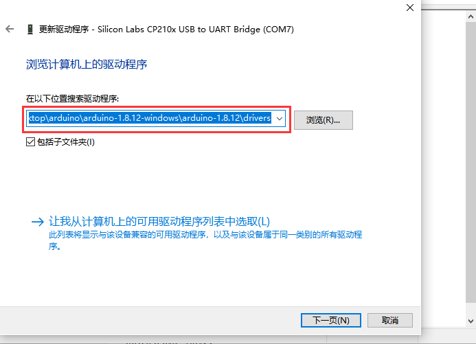

我们选择这个文件夹，然后点击确定，驱动安装成功。

这个时候再打开设备管理器，我就可以看到CP2102的驱动程序已经安装成功了，刚刚的那个黄色的感叹号不见了。

（3）Arduino IDE设置和工具栏介绍

首先我们点击文档中的图标，打开Arduino IDE。

为了避免在将程序上载到板上时出现任何错误，必须选择正确的Arduino板名称，该名称与连接到计算机的电路板相匹配。转到Tools→Board，然后选择你的板。

然后再选择正确的COM口（安装驱动成功后可看到对应COM口）。

我们的程序上传到板之前，我们必须演示Arduino IDE工具栏中出现的每个符号的功能。

A - 用于检查是否存在任何编译错误。

B - 用于将程序上传到Arduino板。

C - 用于创建新草图的快捷方式。

D - 用于直接打开示例草图之一。

E - 用于保存草图。

F - 用于从板接收串行数据并将串行数据发送到板的串行监视器。

（4）启动你的第一个程序

打开文件选择例子，选择第一个文件BASIC里面的BLINK程序

按照前面方法设置板和COM口，IDE右下角显示对应板和COM口。

点击图标开始编译程序，检查错误，检查无误。

点击点击图标开始上传程序，上传成功。

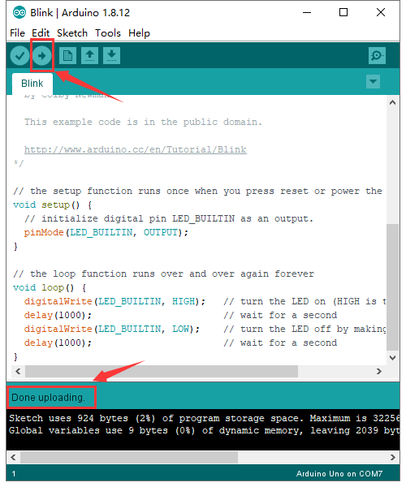

程序上传成功，板载的LED灯亮一秒钟，灭一秒钟，恭喜你的第一个程序完成了！

### 第二小节 在MAC系统电脑详细使用方法

（1）下载安装Arduino IDE 

不同的系统，需要下载不同的Arduino IDE，下载方式和第二小节类似。选择如下图。

（2）驱动安装方法

打开目录下的mac驱动文件夹，双击SiLabsUSBDriverDisk.dmg文件

可以看到以下文件

双击 Install CP210x VCP Driver ，接着勾上Don’t warn me ，点击Open

点击Continue

继续点击Continue ，然后点击Agree

点击Continue ，然后输入你的用户密码

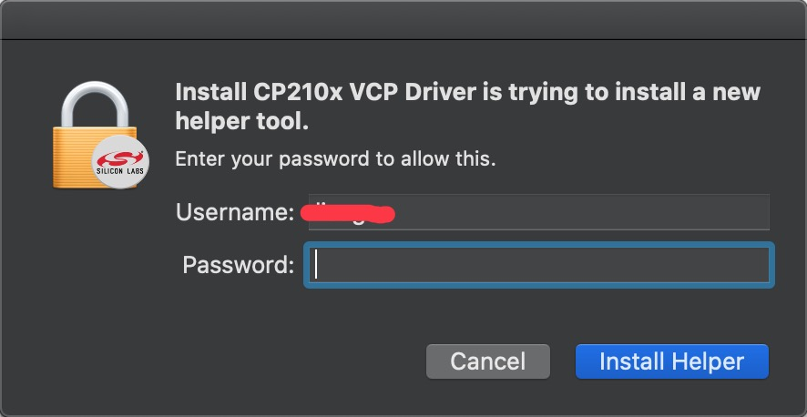

系统安全问题，需要允许安装，点击 Open Security Preferences

点击安全锁 ，输入你的用户密码来授权

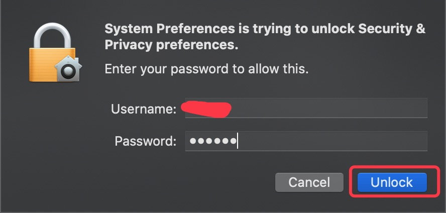

看到锁被打开了，点击Allow

回到安装界面，根据提示等待安装

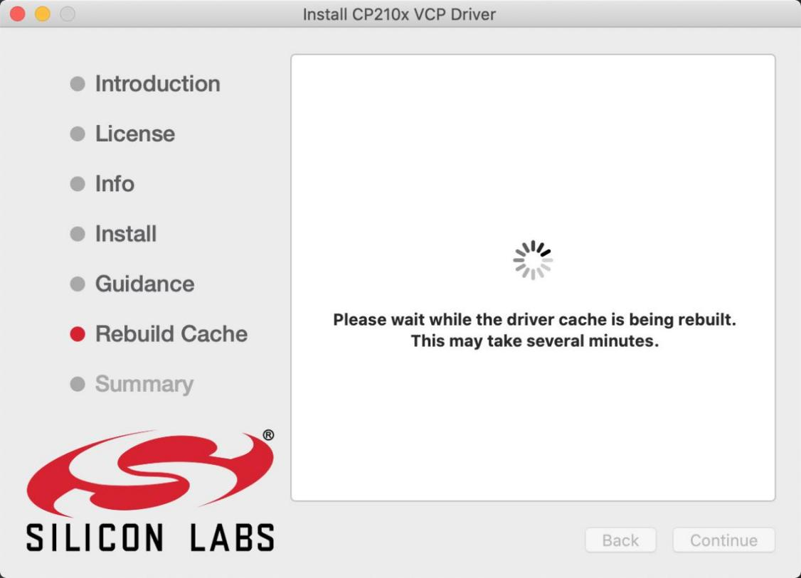

安装成功

（3）Arduino IDE设置

在 Arduino IDE设置时，方法和5.3章节类似，只是设置COM口时不同，如下图。

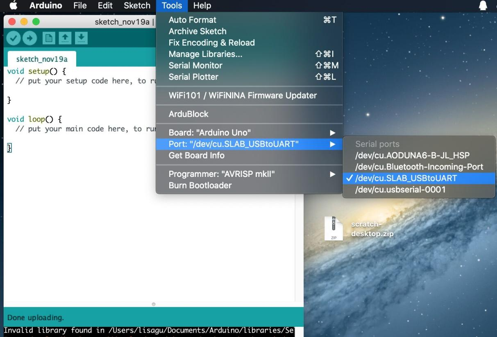

### 第三小节 库文件的添加

库文件。

(1)什么是库文件?

库是一组代码，可以方便地连接到传感器、显示器、模块等。例如，内置的LiquidCrystal库可以帮助与LCD显示器对话。Internet上还有数百个额外的库可供下载。参考资料(https://www.arduino.cc/en/Reference)中列出了内置库和其中一些附加库。

(2)如何安装库 ?

这里我们将介绍一种最简单的添加库的方法 .

第一步：打开文件的安装目录，如下所示：

第二步：
单击打开安装目录下的libraries文件夹，你可以看到library这个文件夹里面含有一些Arduino的库文件。

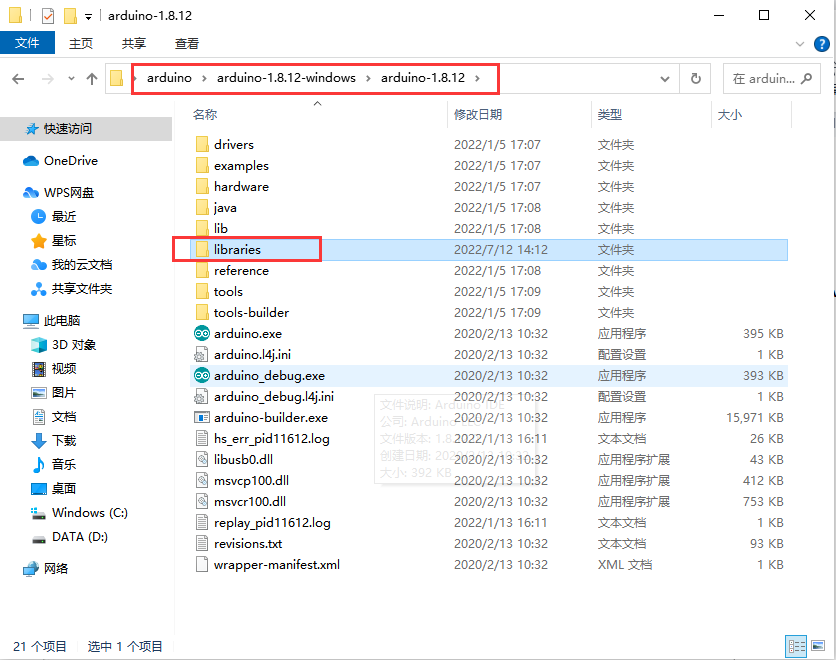

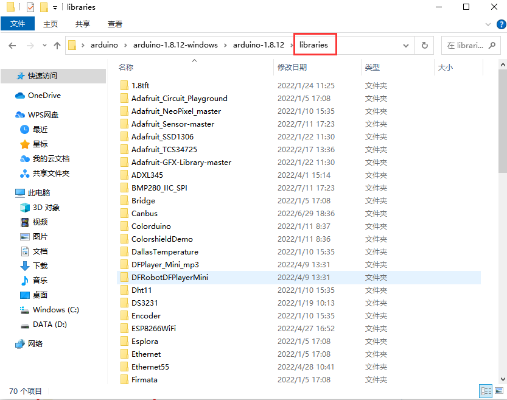

第三步：打开我们提供资料里面的**库文件夹**，将文件夹中的库文件都复制粘贴到第二步我们打开的libraries文件夹内。

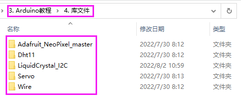

复制好了之后我们的库文件就添加成功了。

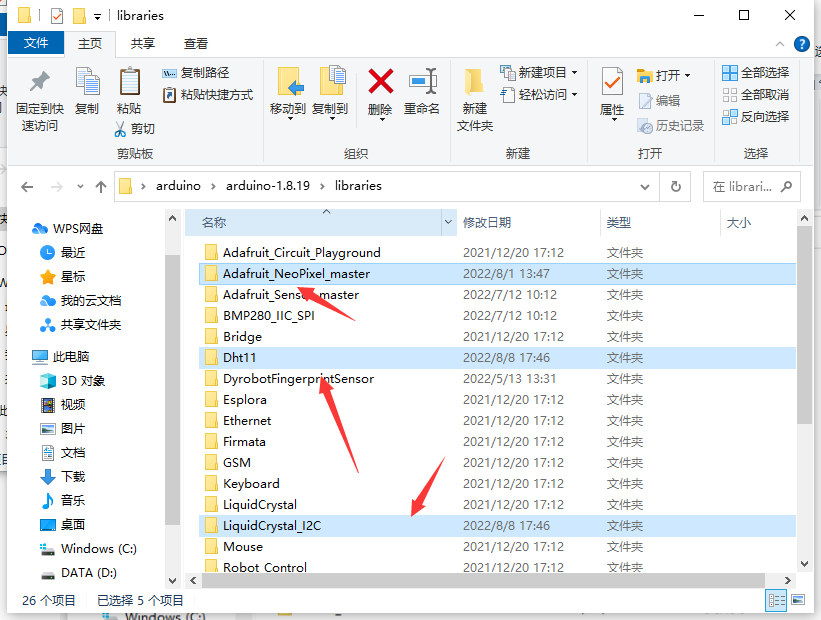

这样，库文件就手动添加完成了。

