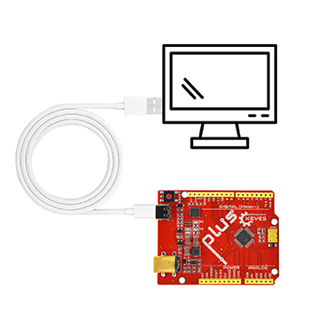
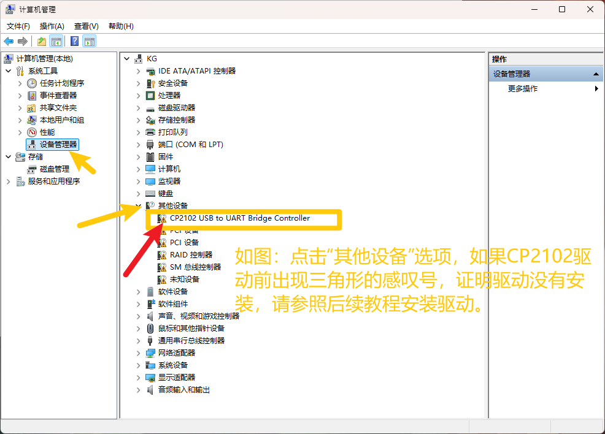
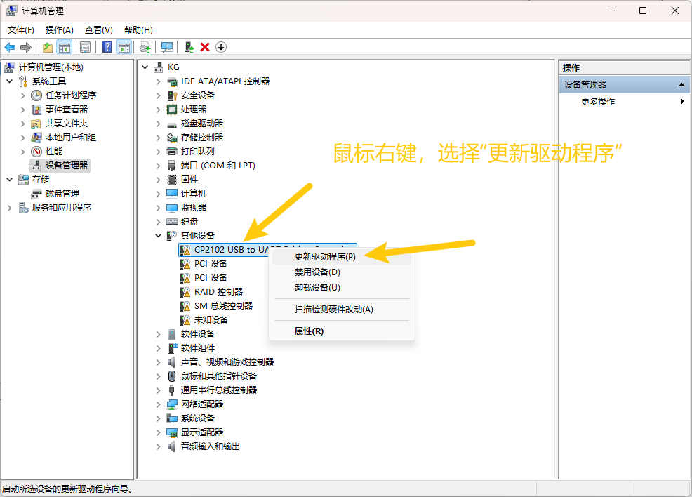
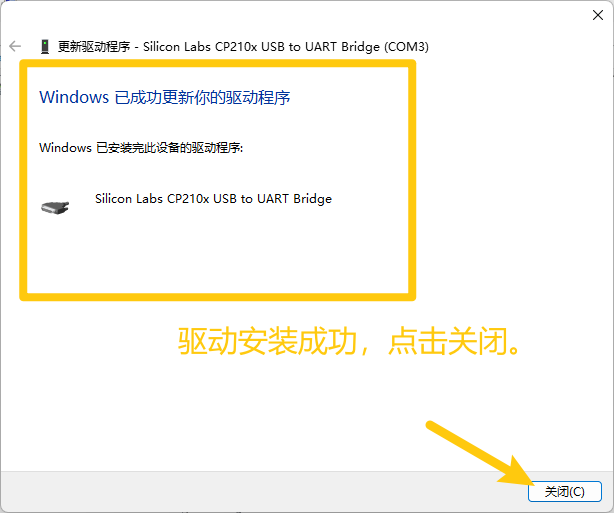

注意：驱动一般在开发板接入电脑的时候自动安装，如果电脑可以正常上传代码到开发板则可以直接跳过本部分，如果无法上传代码并且开发板接入电脑后无法识别到端口，请参照本教程手动安装驱动。（可以先进行Arduino、Scartch或者Mixly课程的学习，若

# 3. 驱动安装

## 3.1 驱动下载

Windows系统驱动下载：[Windows驱动](Windows.7z)

Mac驱动下载：[Mac驱动](./Mac.7z)

## 3.2 Windows系统驱动安装

1、将主板连接到电脑（如图）；

2、打开**“设备管理器”**.

3、检查驱动是否已经安装

情况一：驱动安装完成，请跳过驱动教程，进行下一步学习

情况二：驱动没有安装，请进行以下教程手动安装驱动

4.驱动安装

1、鼠标右击**"CP2102 USB to UART Bridge Controller"**，弹出框中选择**“更新驱动程序（P）”**.

2、点击选择**“浏览我的电脑以查找驱动程序（R）”**.

3、点击**“浏览（R）“**选项，在弹出的方框中找到前面下载到的资料，选择里面的cp2102驱动文件，点击**“确定”**，完成后点击**“下一步”**进行驱动安装.

4、界面显示如下图类似的话语，证明驱动安装成功，点击**“关闭”.**

5.驱动安装完成后，选择**“端口”**选项，如图CP2102的黄色感叹号消失，证明驱动安装完成.

## 3.3 Mac系统驱动安装

1、将主板连接到电脑（如图）；

2、双击解压下载的驱动压缩包

然后一直**“下一步”**安装，直到安装完成

