## 开发环境配置

### **第一小节 安装米思奇软件** 

**1.米思奇（Mixly）软件下载和安装**

打开米思奇软件的官方网站https://mixly.org/explore/software/mixly-arduino，在页面可以看到Mixly2.0最新版和Mixly For的其它版本

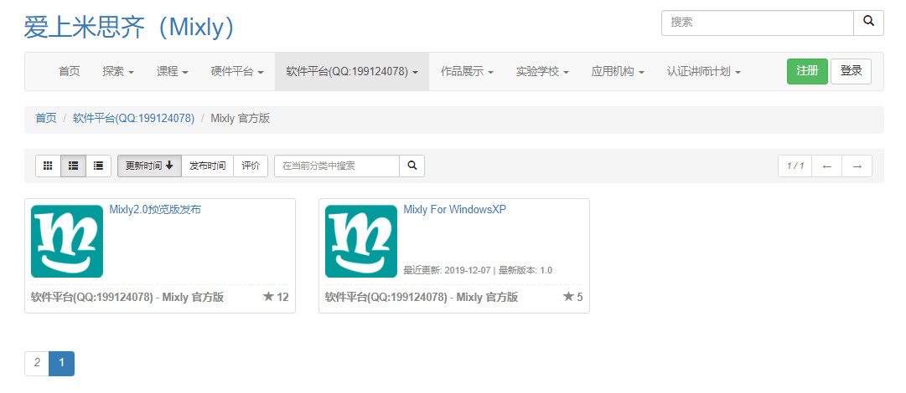

点击Mixly2.0版，再点击Mixly2.0 RC网盘文件下载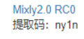

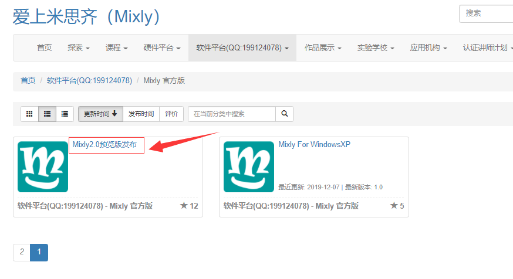

资料有四个系统版本的软件可以供选择，这里以WIN10-x64版本为例，现在的电脑大部分都是WIN10的系统，点击下载自己所需的软件版本

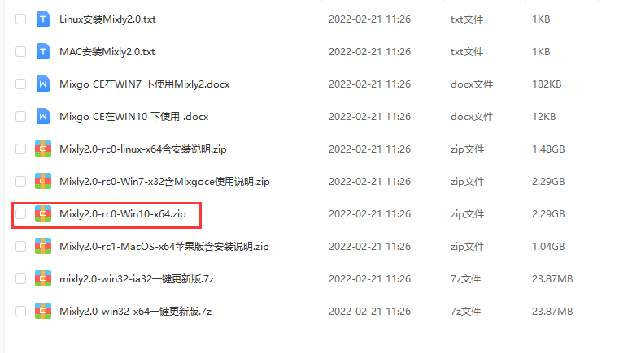

下载好的是米思奇软件的压缩包。压缩包下载好之后，解压到电脑的其中一个硬盘（建议不要放在系统盘），Mixly2.0版本不用安装，解压出来就可以用了

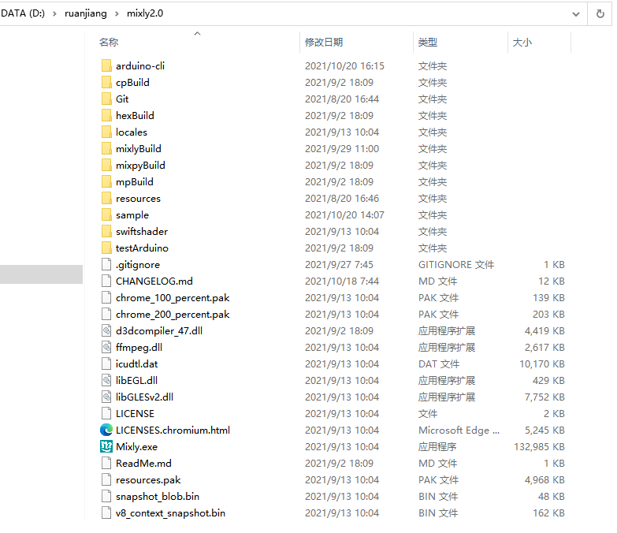

2.软件的更新

点击软件目录下的一键更新

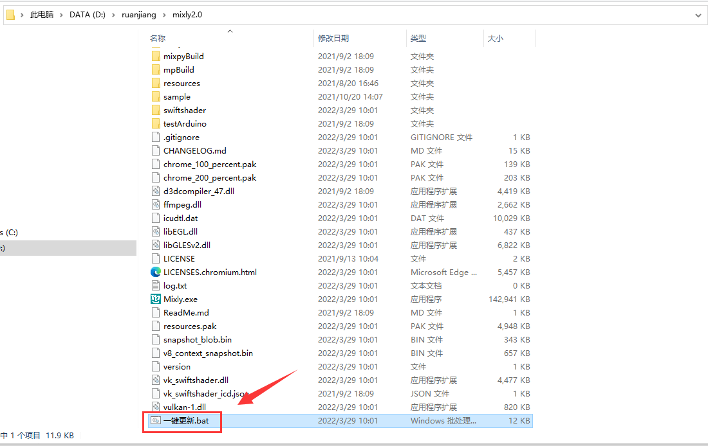

按提示输入“**y**”然后按下Enter键(回车键)即可自动安装，安装完成按下键盘的任意键即可退出

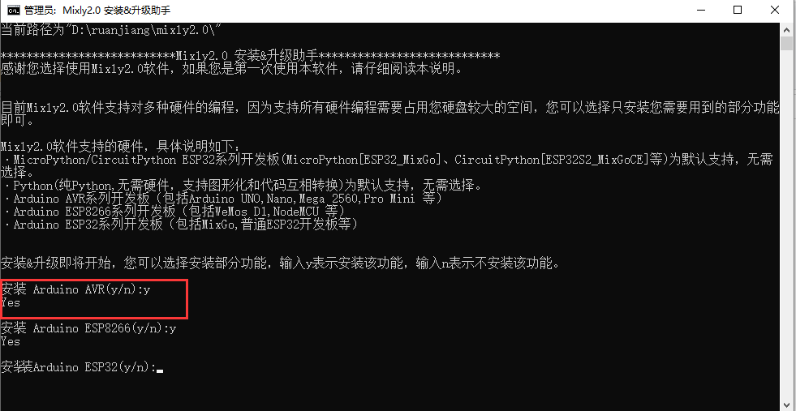

鼠标右键点击Mixly.exe 发送到电脑桌面，方便日后我们使用。

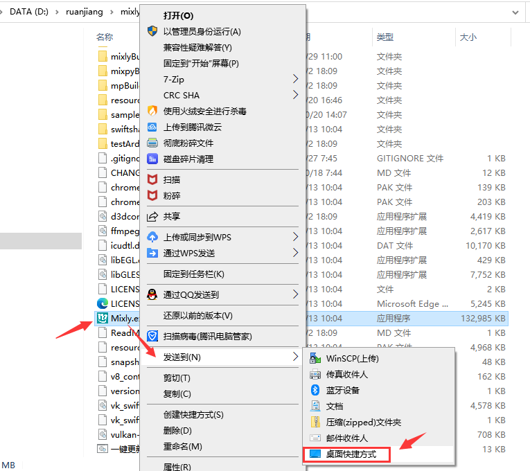

3.米思奇软件介绍 

米思奇（Mixly）是一个免费的开源图形Arduino编程软件，基于Google的图形化编程框架。它是创意电子开发的免费开源图形编程工具；是完整支持创意电子教育的生态系统；是创客教育者实现梦想的舞台。

安装好了软件，我们点击电脑桌面上的mixly图标来打开软件，选择Arduino AVR

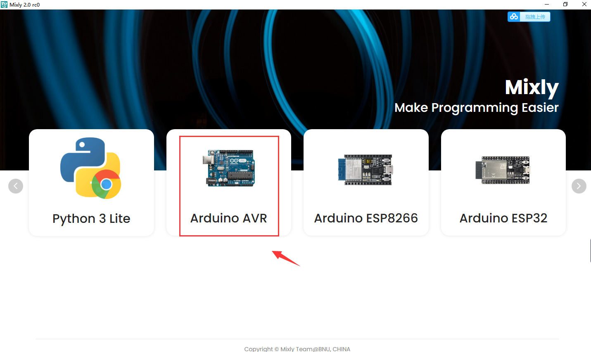

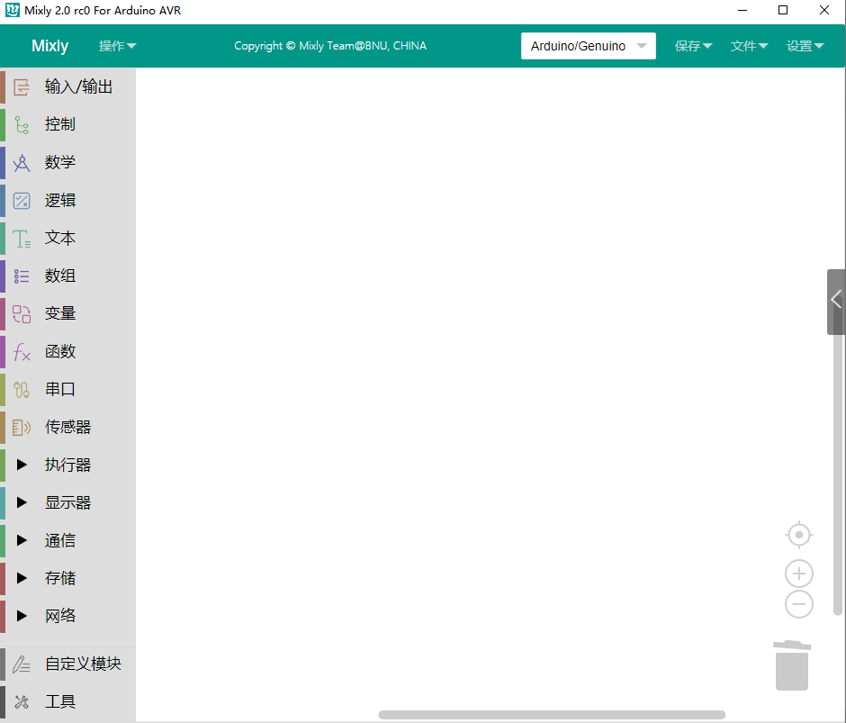

代码程序上传到Arduino开发板或者兼容板之前，必须先了解米思奇软件工具栏中出现的每个区和接口的功能。

界面布局

介绍面总的分为四大功能区域块。

1.基本功能块区

2.程序构建区

3.代码区

4.信息提示区

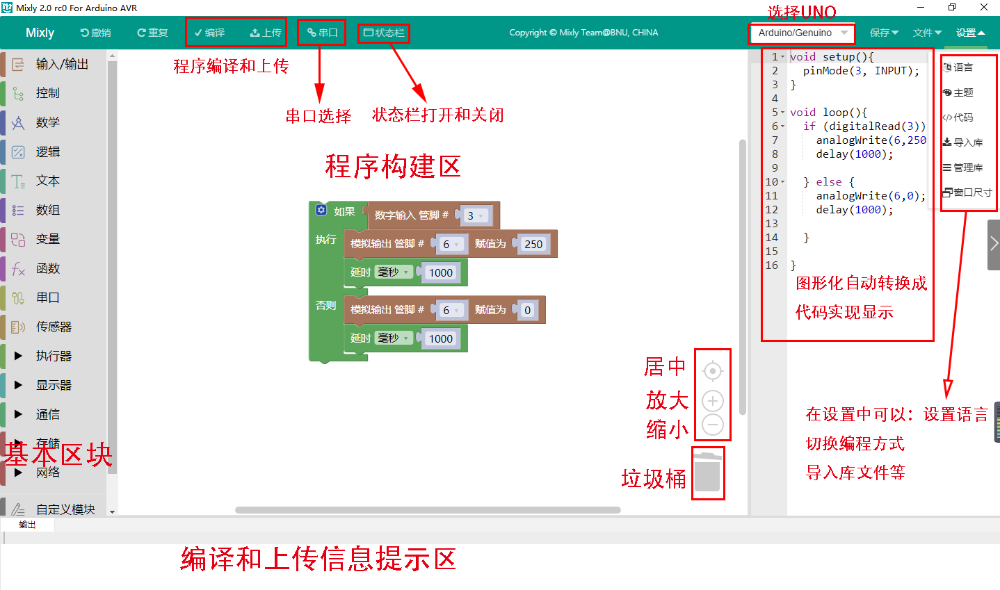

基本功能块区

输入输出: IO相关功能块

控制: 程序流程控制相关功能块

数学: 数学运算相关功能块

文本: 字符串操作相关功能块

数组: 数组相关功能块

逻辑: 逻辑关系的相关功能块

串口: 串口通信相关功能块

通信: 以太网,红外遥控等通讯功能块

储存: 数据储存相关功能块 (高级视图)

传感器: 通用传感器相关功能块

执行器: 通用执行器相关功能块

显示器: 显示相关功能块

以太网:以太网通讯功能块(高级视图)

变量: 变量操作相关功能块

函数: 函数相关功能块

自定义模块: 自定义代码功能块(高级视图)

程序建构区

该区域为程序功能拼接区域。将功能块从左侧块区拖入程序建构区进行拼接。该区域的右下角有个垃圾桶，可以将不用的代码拖进去删除，也可以将不用的代码直接往最左方拖拽（模块选择区），同样可以删除代码。当然，点击不用的代码后点击键盘
Delete也可将代码删除，还可以右键点击块选择删除块.

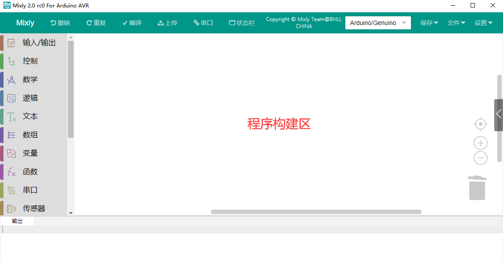

视图缩放

在垃圾桶的上方有两个图形，一个是 ⊕一个是Θ
。该图形可放大或缩小程序构建区模块

的大小。在⊕的上方有一个
按钮，这个按钮的功能是将模块的大小恢复至标准大小，并居中.

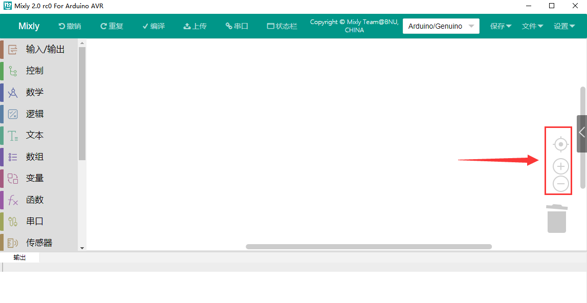

功能切换

语言切换:在该区域的右上角的设置中，还可以切换语言显示的种类。

主题切换:在设置中主题可以进行普通视图和高级视图来进行视图之间的切换。

编程方式切换：在设置中的代码可以切换编程方式。

撤消/重做:撤销功能是当编写代码时误删模块后，便可以点击左箭头或者直接按
Ctrl+Z 来恢复误删代码；而重做则是和 Ctrl+Z 相反。

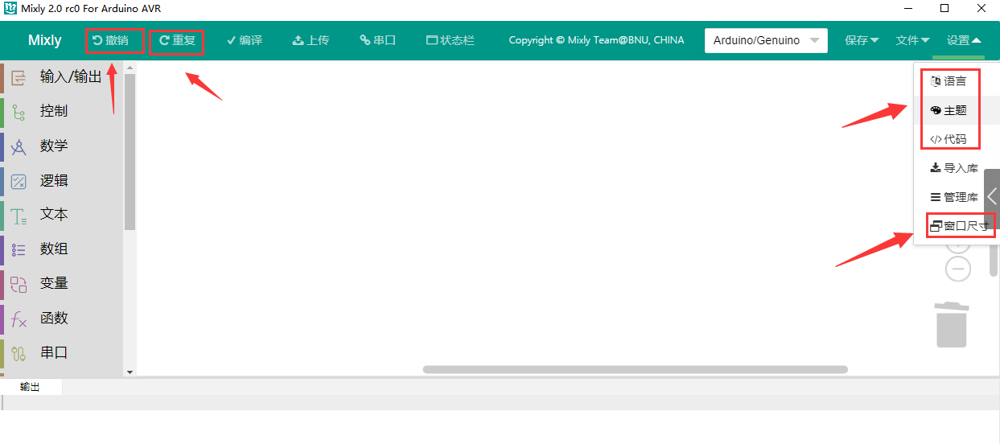

文件操作区

新建:新建项目文件

打开:打开项目文件

保存:保存项目文件

另存为:另存项目文件

导出库:导出当前项目为库文件

导入库:导入第三库文件

管理库:库的删除和重命名等操作

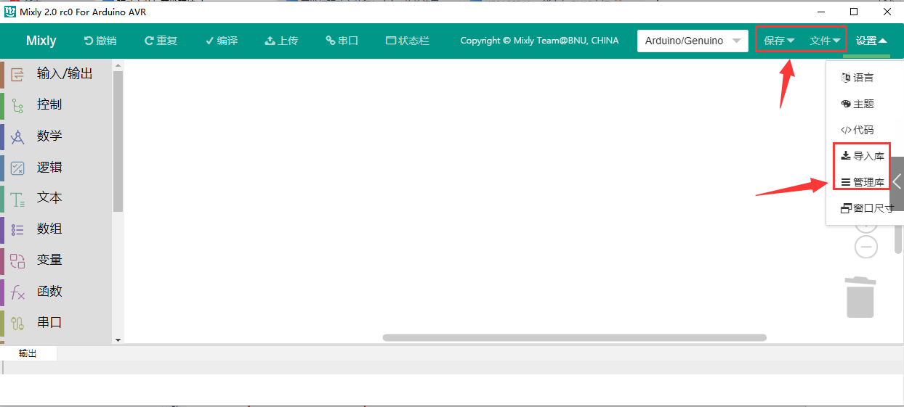

库文件是为了方便代码分享.将一个功能集成在个函数中。之后导出库
文件.就可以分享给他人使用.

代码区

点击代码可以对当前模块自动生成的代码进行修改，修改后如不切换回图形区,进行编译和下载,将按照修改的代码进行编译或者下载.但如果切换回图形区.代码会恢复为图形区的代码.

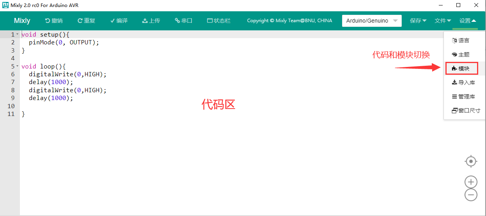

程序下载及串口监视

编译: 将程序编译为机器执行码.编译过程和结果会在信息显示区显示

上传: 编译程序并上传至主板,上传信息会在信息显示区显示.

主板选择: 选择主板类型及连接的端口

串口监视:
用于监视主板从串口发来的信息或者给主板发送信息.需编程.主要用于调试程序或者显示信息用.

**需要注意的是在上传程序时请关闭串口监视窗口.否则会导致程序上传失败**

### 第二小节 安装驱动

（注意：如果电脑已经安装了CH2102驱动程序，则不需要再安装驱动；如果没有，则需要进行以下操作）

**1.Windows上安装驱动** 

安装Mixly后，我们就开始安装驱动。我们开始为Uno Plus 开发板安装驱动。Uno Plus 开发板的USB转串口芯片用的是著名的CP2102
芯片，这样我们使用起来会非常方便。一般插上USB，电脑就会识别到硬件，WINDOWS就会自动安装CP2102的驱动。

如果驱动安装不成功，或者你想手动安装驱动，请打开电脑的设备管理器

显示CP2102的驱动没有安装成功，有一个黄色的感叹号。我们双击硬件更新驱动

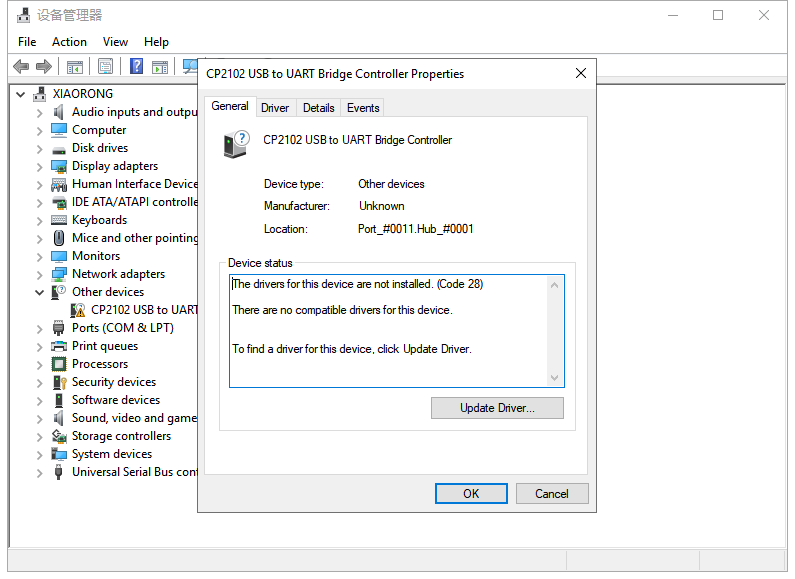

浏览计算机查找驱动程序，找到我们提供的驱动文件目录下的文件

选择这个dirvers文件夹，然后点击确定，驱动安装成功。

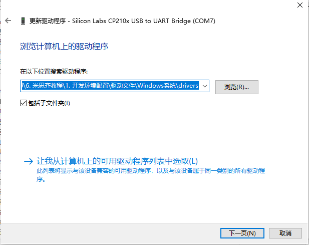

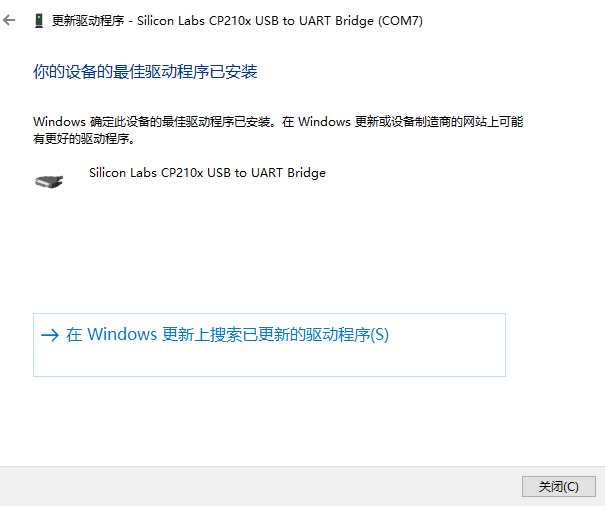

这个时候再打开设备管理器，我就可以看到CP2102的驱动程序已经安装成功了，刚刚的那个黄色的感叹号不见了。

**2.在MAC 系统电脑上安装驱动方法** 

打开目录下的mac驱动文件夹，双击SiLabsUSBDriverDisk.dmg文件

可以看到以下文件

双击 Install CP210x VCP Driver ，接着勾上Don’t warn me ，点击Open

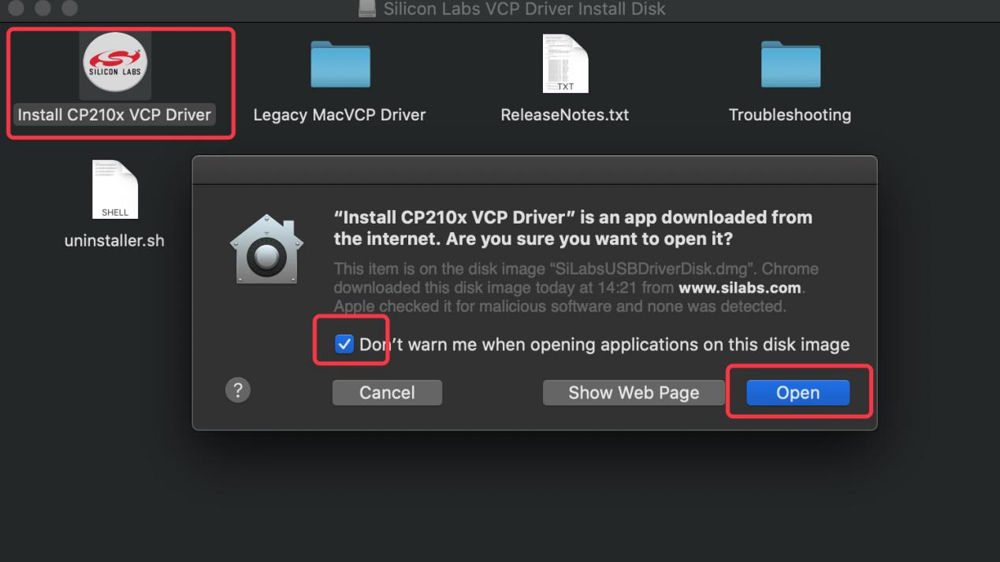

点击Continue

继续点击Continue ，然后点击Agree

点击Continue ，然后输入你的用户密码

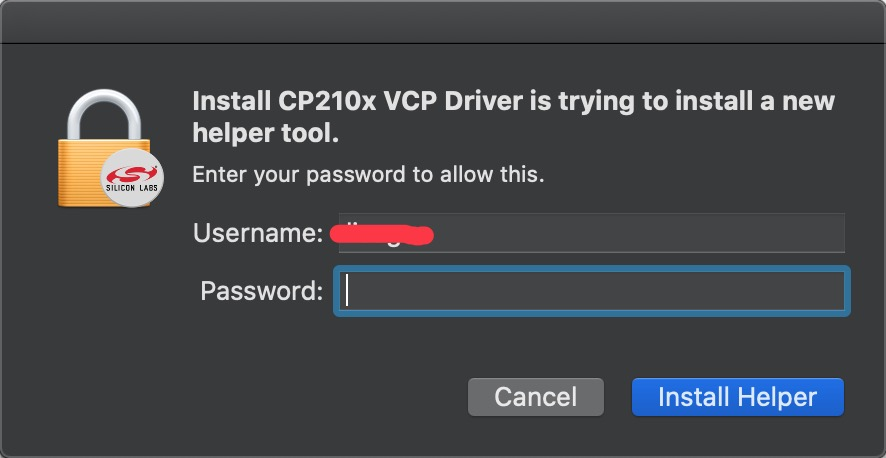

系统安全问题，需要允许安装，点击 Open Security Preferences

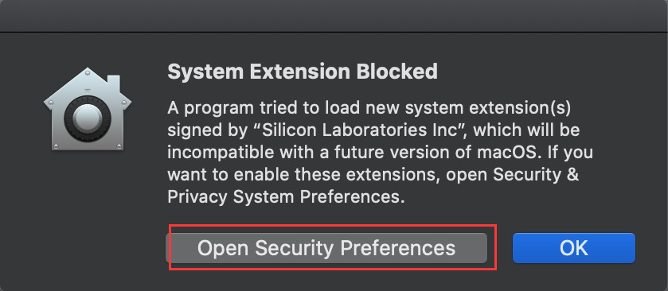

点击安全锁 ，输入你的用户密码来授权

看到锁被打开了，点击Allow

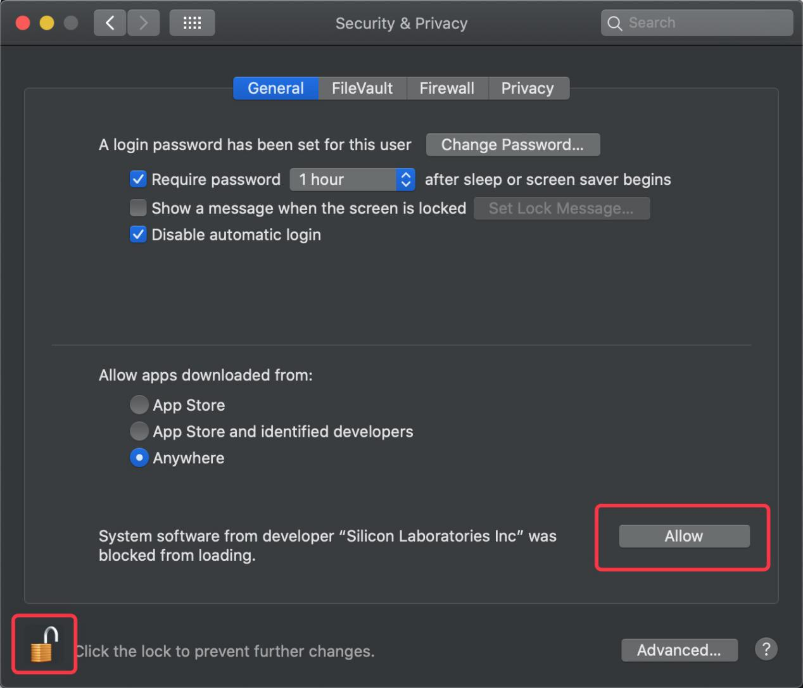

回到安装界面，根据提示等待安装

安装成功

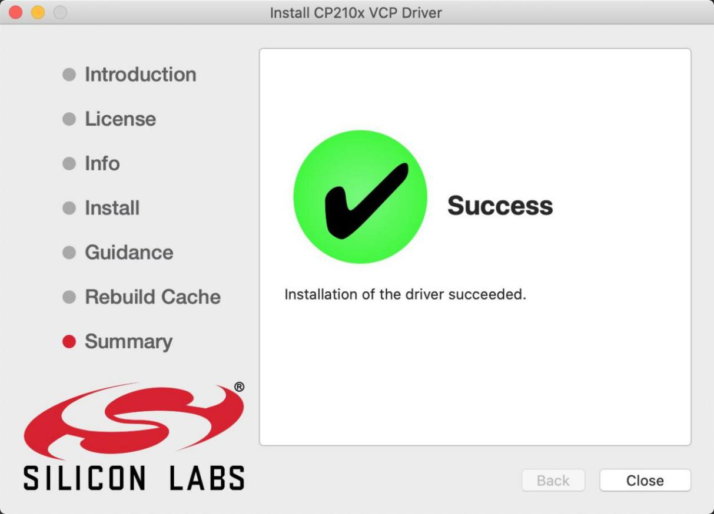

### 第三小节 导入库文件

打开米思奇软件，点击设置----\>导入库

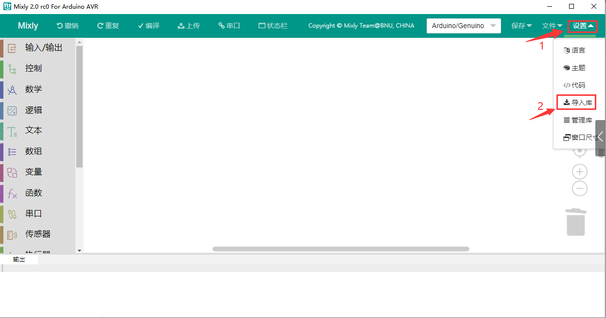

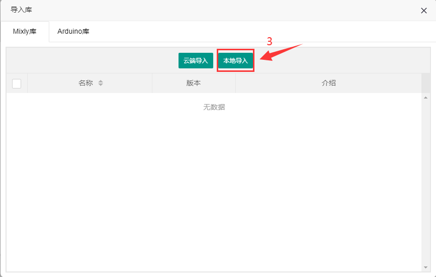

点击本地导入

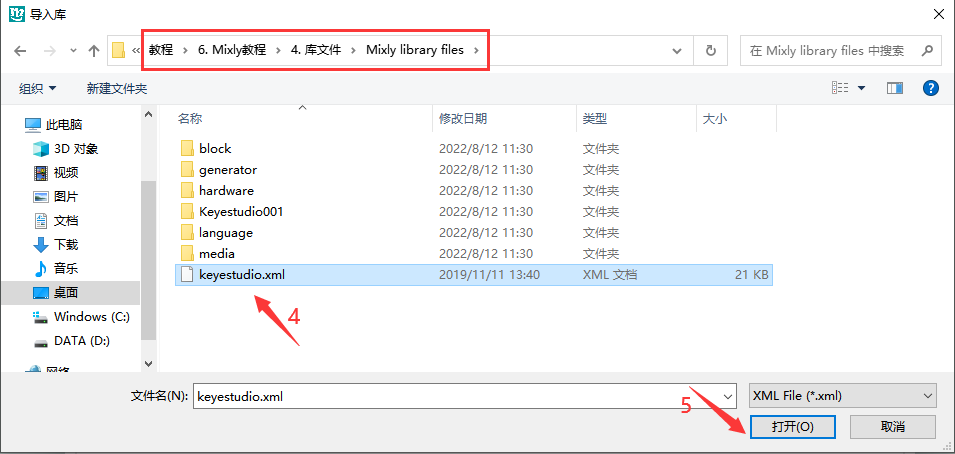

选择我们文件里提供的Keyestudio文件，这样米思奇库文件就导入完成了。

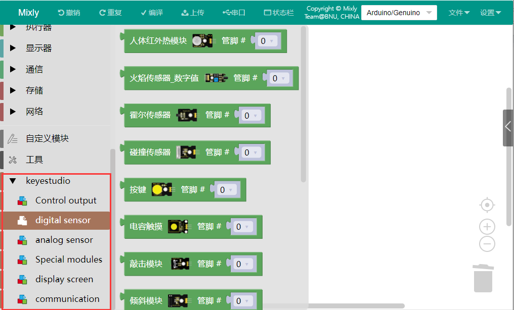

### 第四小节 启动你的第一个程序

打开我们安装好的Mixly软件选择Arduino AVR进入编程环境

①点击**输入/输出**栏，拖出**数字输出**代码块，放入初始化里面，设置管脚为13（点击可选择管脚），电平为高，点亮LED。

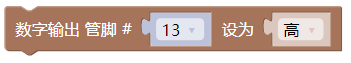

③在**控制**栏目里拖出延时模块，设置为1000毫秒

④再复制一个**数字输出**代码块，设置管脚为13，电平为低，熄灭LED

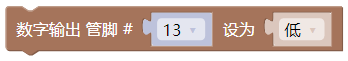

⑤再来一个延时1000毫秒

\*\*\*\*\*\*\*\*\*\*\*\*\*\*\*\*\*\*\*\*\*\*\*\*\*\*\*\*\*\*\*\*完整的代码如下\*\*\*\*\*\*\*\*\*\*\*\*\*\*\*\*\*\*\*\*\*\*\*\*\*\*\*\*\*\*\*\*

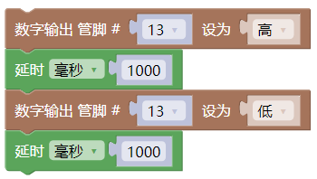

开发板用USB线连接好电脑；上传程序：选择正确串口，波特率是：9600；控制板选择Arduino uno板；然后点击上传程序，程序上传成功会提示上传成功。

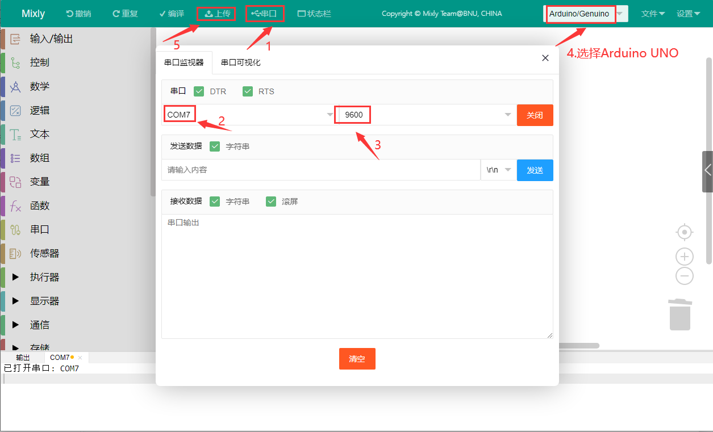

程序上传成功，板载的LED灯亮一秒钟，灭一秒钟，恭喜你的第一个程序完成了！

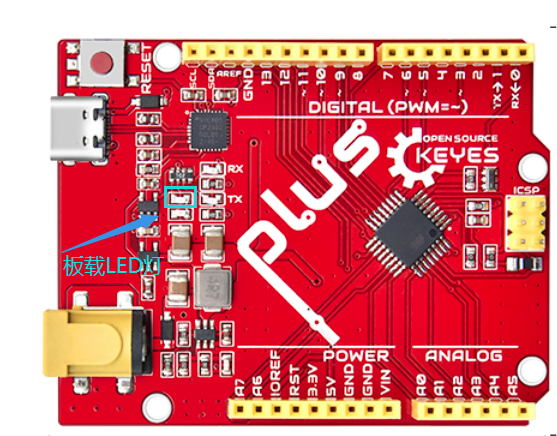

